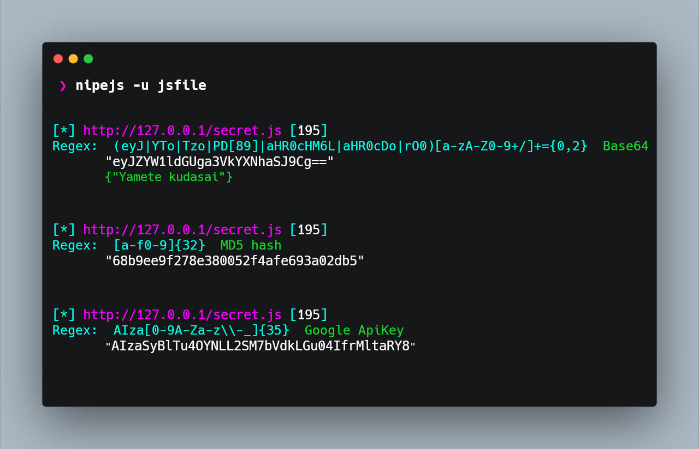

# NipeJS

> Read list of JS files and look for sensitive data via regex. 


## ☕ Install

```bash
go get github.com/i5nipe/nipejs
```

## ☕ Regular expressions
> Download the file "[files/regex.txt](https://github.com/i5nipe/nipejs/blob/master/files/regex.txt)"

- You don't need to specify the regex file if you put it in `~/.nipe/regex.txt`.

- This tool has some special regex, e.g. decrypt base64 strings.

- Automatically test the authenticity of some API keys 

## ☕ Usage examples

```
nipejs -u jsfile -r regex.txt

nipejs -u ~/Path/to/jsfile -s -r regex.txt

cat jsfile | nipejs -r regex.txt
```

## Credits

- [KeyHacks](https://github.com/streaak/keyhacks)
- [JSScanner](https://github.com/0x240x23elu/JSScanner)
- [ProjectDiscovery/gologger](https://github.com/projectdiscovery/gologger)
- [odomojuli/RegExAPI](https://github.com/odomojuli/RegExAPI)
- [l4yton/RegHex](https://github.com/l4yton/RegHex)
- [logrusorgru/aurora](https://github.com/logrusorgru/aurora)
